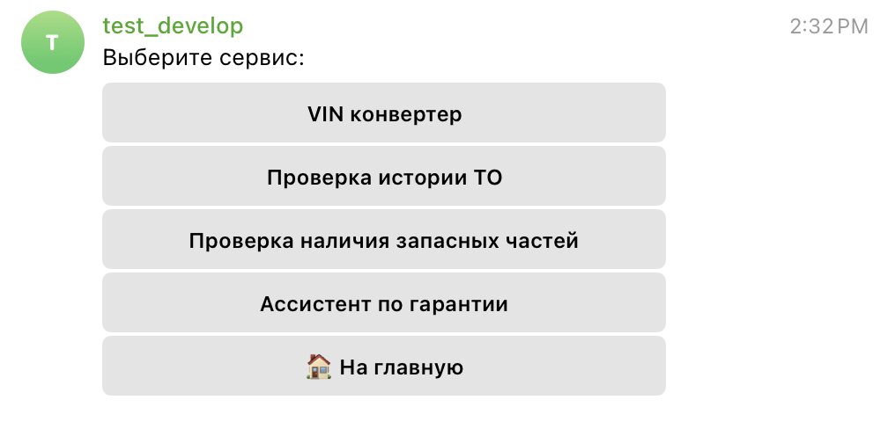

# Telegram-бот (Ассистент сотрудника Дилерского центра)

Данный бот-сервис предназначен для мастеров консультантов, специалистов ОЗЧ и инженеров по гарантии дилерский предприятий.

## Стек технологий


## Возможности бота

#### VIN конвертер
#### Узнать наличие запчасти по артикулу
#### Проверить историю ТО
#### Получить ответ на вопрос в рамках Гарантийной политики от ИИ-ассистента
#### Ежедневное обновление базы данных по наличию запасных частей с помощью AsyncIOScheduler

##### О сервисах бота:


##### Личный кабинет:


##### Каталог:



##### Админ зона:


##### Пример ассистента:


##### Оплата подписки на сервис:


## Развёртывание

ля развертывания проекта используйте Docker. Убедитесь, что у вас установлены Docker и Docker Compose.

### Выполните следующие команды:

Запуск Docker Compose с конфигурацией:

```
docker compose up --build
```

Миграции для базы данных:

```
alembic revision --autogenerate -m "Initial revision"

alembic upgrade head
```


Заполнение базы данных:

```
sudo docker exec -it assistant_bot-app-1 bash

sudo docker exec -it assistant_bot-app-1 bash

python -m data.vin_json_upload --json_root 'data/vin_decoder.json'

python -m data.parts_json_upload --json_root 'data/merged_parts.json'

python -m data.maintenance_csv_upload --csv_root 'data/maintenance.csv'
```